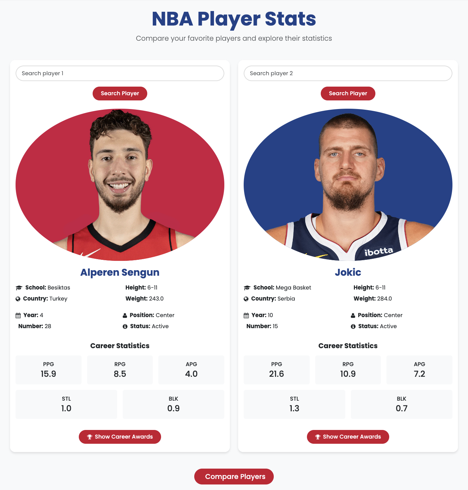
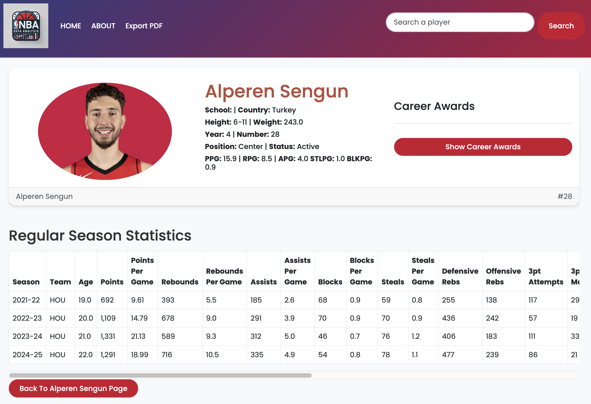
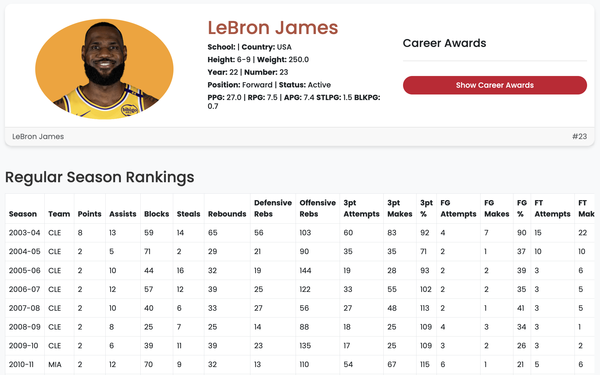
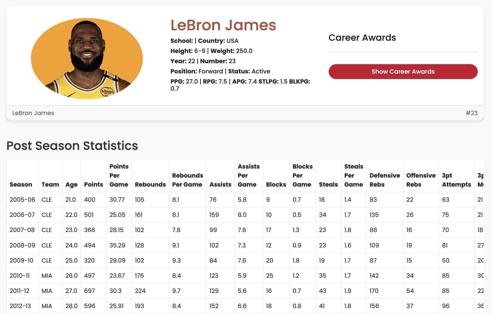

# NBA Data Analysis

NBA Data Analysis is a dynamic Django web application tailored for basketball enthusiasts and analysts eager to explore detailed NBA player statistics. Leveraging the power of `nba_api`, this platform provides real-time statistics, insightful comparisons, and downloadable player data, making it your comprehensive resource for professional basketball insights.

## Table of Contents

- [Installation](#installation)
- [Usage & Features](#usage-&-features)
- [Overview](#overview)
- [Objectives](#objectives)
- [Key Features](#key-features)
- [Project Scope](#project-scope)
- [Technologies & Tools](#technologies--tools)
- [Project Timeline & Phases](#project-timeline--phases)
- [Team Members & Roles](#team-members--roles)
- [Functional & Non-Functional Requirements](#functional--non-functional-requirements)

## Installation

To set up the NBA Data Analysis project locally, follow these straightforward steps:

### Prerequisites
- Ensure you have Python 3.7+ installed.
- Install PostgreSQL on your system.

### Steps

1. **Clone the Repository:**
```bash
git clone https://github.com/tunahan-oguz/NBADataAnalysis.git
```

2. **Navigate to the Project Directory:**
```bash
cd NBADataAnalysis
```

3. **Create and Activate a Virtual Environment:**

- **Windows:**
```bash
python -m venv venv
venv\Scripts\activate
```

- **macOS/Linux:**
```bash
python -m venv venv
source venv/bin/activate
```

4. **Install Dependencies:**
```bash
pip install -r requirements.txt
```

5. **Set Up PostgreSQL Database:**

Open your PostgreSQL shell or use pgAdmin and execute the following commands:
```sql
CREATE DATABASE nbadb;

CREATE USER tun WITH PASSWORD '123';
ALTER ROLE tun SET client_encoding TO 'utf8';
ALTER ROLE tun SET default_transaction_isolation TO 'read committed';
ALTER ROLE tun SET timezone TO 'UTC';
GRANT ALL PRIVILEGES ON DATABASE nbadb TO tun;
```

6. **Configure Environment Variables:**

Update your `.env` file located in the project's root directory with the following details:
```env
DB_NAME=nbadb
DB_USER=tun
DB_PASSWORD=123
DB_HOST=localhost
DB_PORT=5432

SMARTPROXY_URL=http://gate.smartproxy.com:10001
SMARTPROXY_USERNAME=your_username_here
SMARTPROXY_PASSWORD=your_password_here

SECRET_KEY=your_django_secret_key
DEBUG=True
```

7. **Apply Database Migrations:**
```bash
python manage.py migrate
```

8. **Run the Development Server:**
```bash
python manage.py runserver
```

Access the application by navigating to `http://localhost:8000/` in your web browser.

## Usage

Explore NBA Data Analysis easily by:


## Usage & Features

- **Player Search:** Quickly access detailed statistics and profiles by searching players by name, team, or position.

- **Data Export:** Conveniently download statistics for any selected player in a user-friendly format.

- **Player Comparison:** Easily compare two players head-to-head across multiple statistical categories, visualizing their performance differences.

- **Regular Season and Playoff Statistics:** Explore comprehensive statistical breakdowns tailored to both regular season and playoff performances.





## Overview

The NBA Data Analysis Project is a full-stack web application that:
- **Aggregates and processes NBA datasets** from Kaggle.
- **Cleans, integrates, and analyzes** multiple data sources.
- **Delivers interactive dashboards** for player performance, team trends, and custom data queries.
- **Generates automated reports** in PDF and CSV formats for further analysis.

---

## Objectives

- **Develop a fully functional web application** displaying NBA player statistics and analytics.
- **Implement interactive data visualizations** (e.g., charts, graphs) to facilitate data interpretation.
- **Enable player comparisons** using key performance metrics.
- **Provide search and filtering functionality** for quick access to relevant information.
- **Ensure a responsive, modern UI** that works seamlessly on desktop and mobile devices.

---

## Key Features

- **Player Performance Dashboard:** Visualize key statistics and trends for individual players.
- **Player Comparison Tool:** Compare multiple players side-by-side using essential metrics.
- **Advanced Visualizations:** Interactive charts and graphs for in-depth data analysis.
- **Team Analytics:** Display aggregated team statistics and seasonal performance insights.
- **Search & Filter Functionality:** Quickly locate players, teams, and specific data points.
- **Automated Reporting:** Export analytics reports in PDF, HTML, or CSV formats.
- **Data Export & Querying:** Export processed datasets and execute custom queries on the unified data repository.
- **User Access & Role Management:** Secure user authentication and authorization.

---

## Project Scope

**Included:**
- Data extraction, cleaning, and processing from Kaggle NBA datasets.
- Integration of multiple data sources into a unified repository.
- Development of interactive visualizations and dashboards.
- Implementation of player and team comparison tools.
- Creation of a responsive, user-friendly web interface.

**Not Included:**
- Real-time live game updates.
- AI-based predictive analytics.
- Betting, fantasy basketball, or video-based features.

---

## Technologies & Tools

- **Programming Languages:** Python, JavaScript (React.js), HTML/CSS
- **Web Frameworks:** Flask or Django for backend development
- **Database:** MySQL/PostgreSQL for data storage and integration
- **Data Processing & Visualization:** Pandas, NumPy, Matplotlib, Seaborn, Plotly
- **Version Control & Collaboration:** GitHub
- **Development Tools:** VS Code, Docker
- **UI/UX Design:** Figma, Adobe XD

---

## Project Timeline & Phases

| Phase                             | Start Date   | End Date     | Deliverable                                  |
|-----------------------------------|--------------|--------------|----------------------------------------------|
| **Requirements Gathering**        | Feb 15, 2025 | Feb 25, 2025 | Finalized feature list & project scope       |
| **Data Collection & Processing**  | Feb 26, 2025 | Mar 1, 2025  | Cleaned & structured NBA dataset             |
| **UI/UX Design & Prototyping**    | Mar 1, 2025  | Mar 25, 2025 | Wireframes & UI prototype                    |
| **Backend & Database Development**| Mar 1, 2025  | Mar 25, 2025 | Functional backend with data integration     |
| **Frontend Development**          | Mar 1, 2025  | Mar 25, 2025 | Fully responsive web app                     |
| **Testing & Debugging**           | Mar 26, 2025 | Mar 31, 2025 | Bug fixes & performance optimization         |
| **Deployment & Final Review**     | Apr 1, 2025  | Apr 4, 2025  | Deployed live application                    |
| **Project Closure & Evaluation**  | Apr 5, 2025  | Apr 10, 2025 | Final project report & assessment            |

---

## Team Members & Roles

- **Tunahan Oğuz:** Backend Developer / Tester
- **Ali Eren Kurt:** Frontend Developer / Product Owner
- **Alkım Doryan:** Project Manager / Tester / Scrum Master
- **Beyzanur Zeybek:** Requirements Analyst / Frontend Developer

---

## Functional & Non-Functional Requirements

### Functional Requirements

- **Data Ingestion:** Import multiple CSV/database files (e.g., player info, game summaries, team details).
- **Data Cleaning & Preprocessing:** Handle missing values and standardize data formats.
- **Data Integration:** Link multiple tables into a unified repository.
- **Exploratory Data Analysis:** Generate descriptive statistics and initial visualizations.
- **Visualization Dashboard:** Interactive charts and filters for data exploration.
- **Automated Reporting:** Generate and export reports in PDF, HTML, or CSV formats.
- **Data Export & Custom Querying:** Export processed data and execute custom queries.
- **User Access & Role Management:** Secure authentication and role-based permissions.

### Non-Functional Requirements

- **Performance:** Ensure query and dashboard responses within 2 seconds.
- **Scalability:** Handle increasing data volumes efficiently.
- **Usability:** Offer an intuitive interface accessible to technical and non-technical users.
- **Compatibility:** Work consistently across major browsers (Chrome, Firefox, Safari, Edge).
- **Security:** Implement robust authentication, authorization, and encryption measures.
